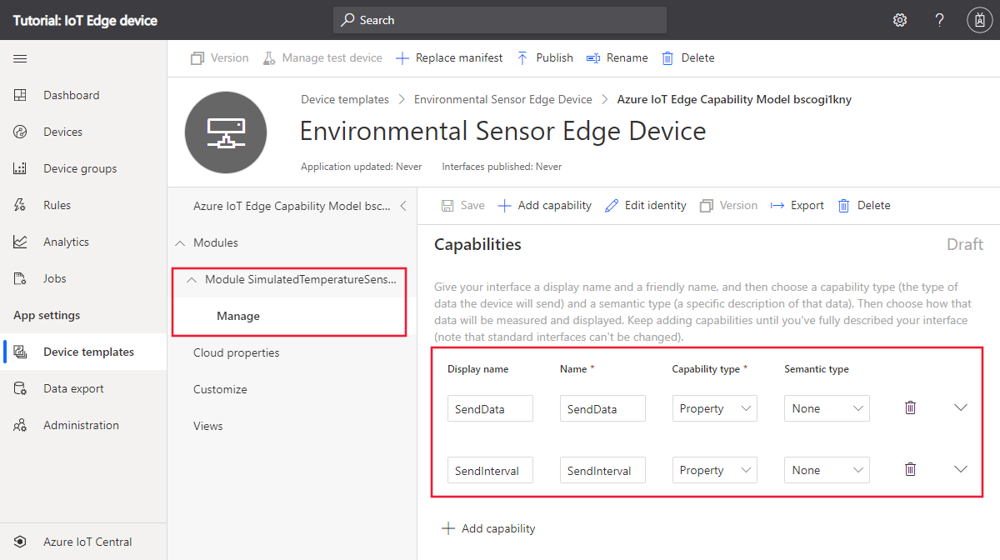
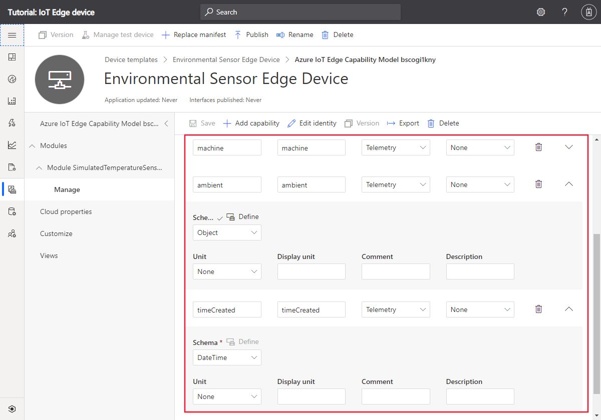
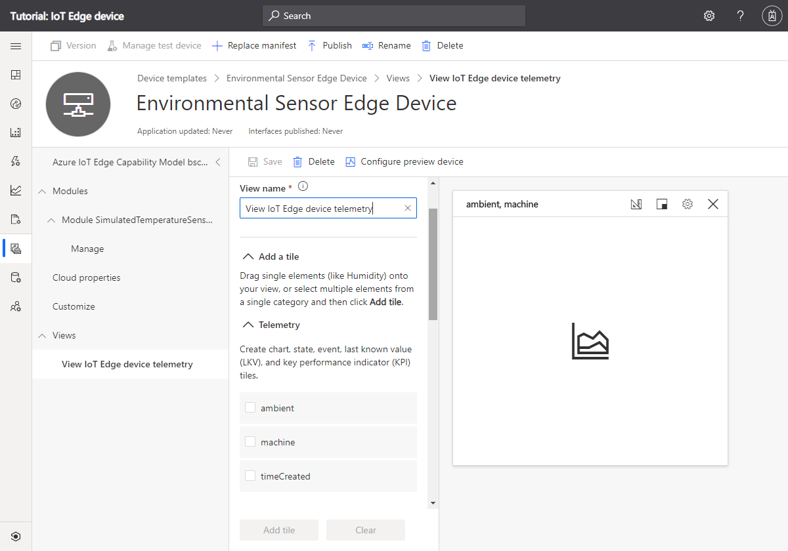
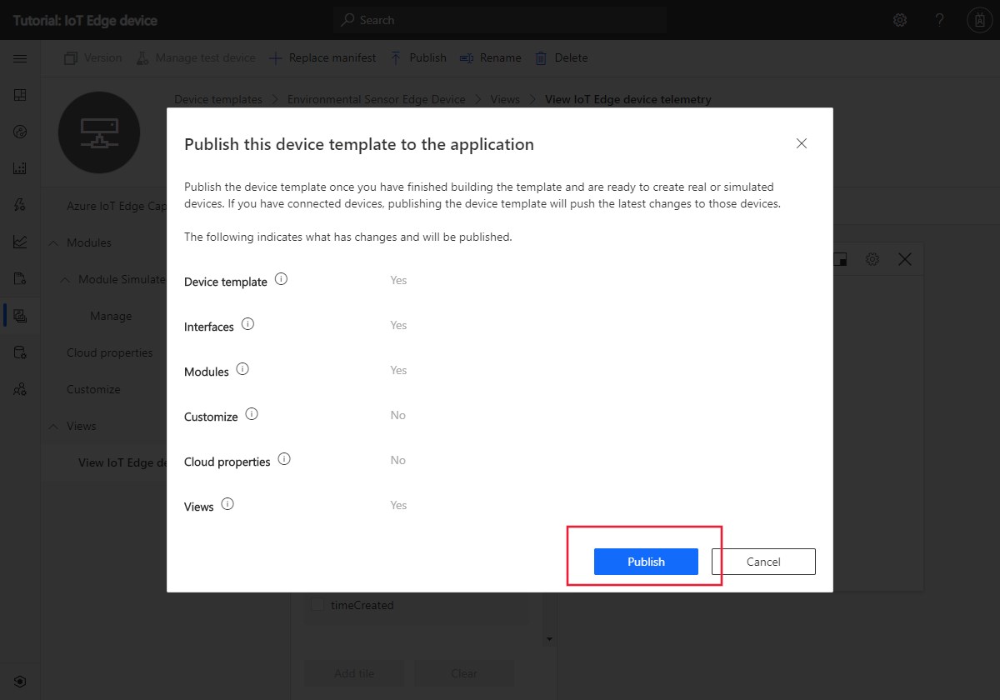
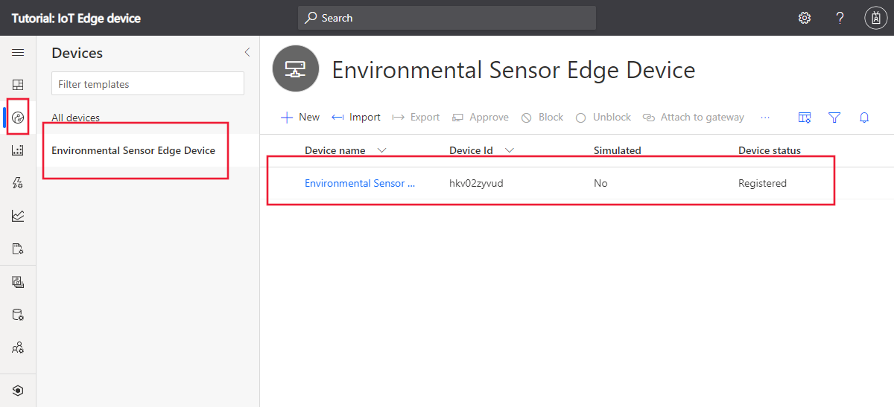
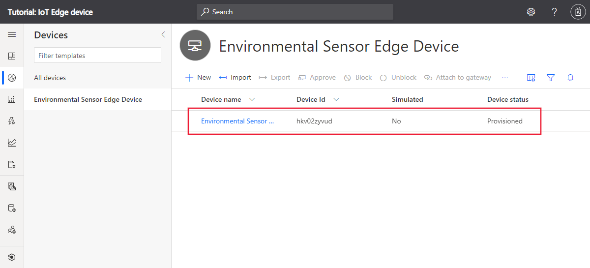
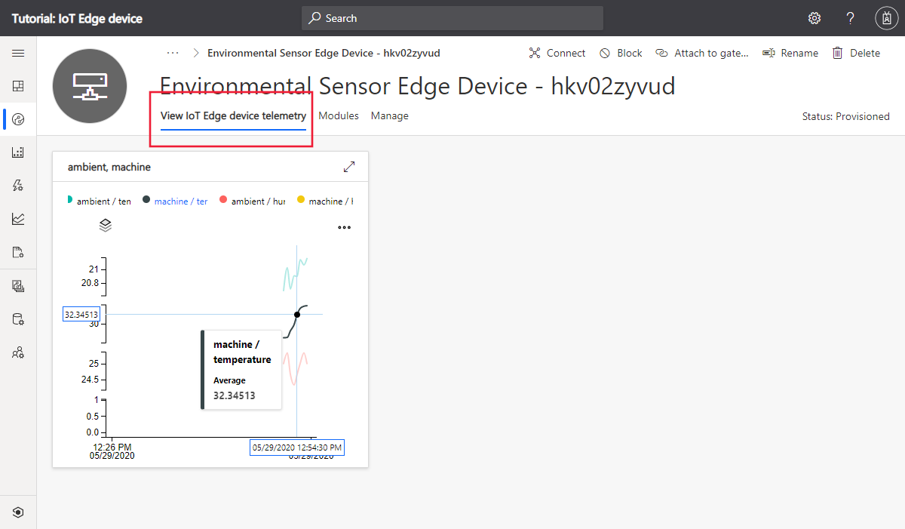
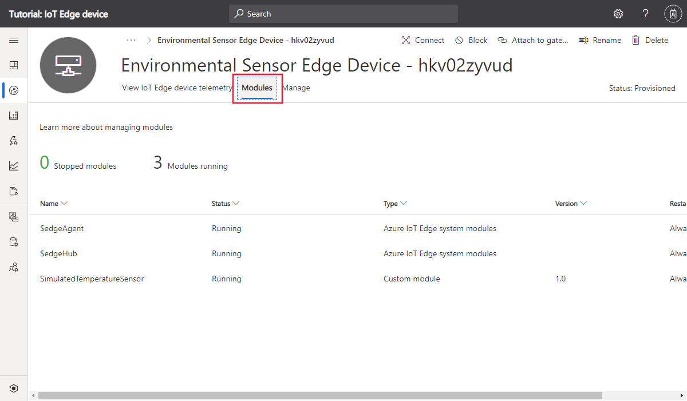

# Azure IoT Edge Device

This tutorial will guide you through the installation of the IoT Edge Runtime and provision of an IoT Edge Device on a linux machine. 

To provision an IoT Edge Device in other systems, please refer to the official Microsoft documentation [here](https://docs.microsoft.com/en-us/azure/iot-edge/support#operating-systems).


## Step 1 - Install IoT Edge Runtime

The Azure IoT Edge runtime is what turns a device into an IoT Edge device. The runtime can be deployed on devices as small as a Raspberry Pi or as large as an industrial server. Once a device is configured with the IoT Edge runtime, you can start deploying business logic to it from the cloud. To learn more, see [Understand the Azure IoT Edge runtime and its architecture](https://docs.microsoft.com/en-us/azure/iot-edge/iot-edge-runtime).

### Prerequisites

#### A linux device

Have an X64, ARM32, or ARM64 Linux device. Microsoft provides installation packages for Ubuntu Server 18.04 and Raspberry Pi OS Stretch operating systems.

For the latest information about which operating systems are currently supported for production scenarios, see [Azure IoT Edge supported systems](https://docs.microsoft.com/en-us/azure/iot-edge/support#operating-systems)


#### Prepare your device to access the Microsoft installation packages

Install the repository configuration that matches your device operating system.

* Ubuntu Server 18.04:
```bash
curl https://packages.microsoft.com/config/ubuntu/18.04/multiarch/prod.list > ./microsoft-prod.list
```

* Raspberry Pi OS Stretch:

```bash
curl https://packages.microsoft.com/config/debian/stretch/multiarch/prod.list > ./microsoft-prod.list
```

Copy the generated list to the sources.list.d directory.

```bash
sudo cp ./microsoft-prod.list /etc/apt/sources.list.d/
```

Install the Microsoft GPG public key.

```bash
curl https://packages.microsoft.com/keys/microsoft.asc | gpg --dearmor > microsoft.gpg
sudo cp ./microsoft.gpg /etc/apt/trusted.gpg.d/
```

Azure IoT Edge software packages are subject to the license terms located in each package (`usr/share/doc/{package-name}` or the `LICENSE` directory). Read the license terms prior to using a package. Your installation and use of a package constitutes your acceptance of these terms. If you do not agree with the license terms, do not use that package.

### Install a container engine

Azure IoT Edge relies on an OCI-compatible container runtime. For production scenarios, we recommended that you use the Moby engine. The Moby engine is the only container engine officially supported with Azure IoT Edge. Docker CE/EE container images are compatible with the Moby runtime.

Update package lists on your device.

```bash
sudo apt-get update
```

Install the Moby engine.

```bash
sudo apt-get install moby-engine
```

If you get errors when installing the Moby container engine, verify your Linux kernel for Moby compatibility. Some embedded device manufacturers ship device images that contain custom Linux kernels without the features required for container engine compatibility. Run the following command, which uses the [check-config script](https://github.com/moby/moby/blob/master/contrib/check-config.sh) provided by Moby, to check your kernel configuration:

```bash
curl -sSL https://raw.githubusercontent.com/moby/moby/master/contrib/check-config.sh -o check-config.sh
chmod +x check-config.sh
./check-config.sh
```

In the output of the script, check that all items under `Generally Necessary` and `Network Drivers` are enabled. If you are missing features, enable them by rebuilding your kernel from source and selecting the associated modules for inclusion in the appropriate kernel .config. Similarly, if you are using a kernel configuration generator like `defconfig` or `menuconfig`, find and enable the respective features and rebuild your kernel accordingly. Once you have deployed your newly modified kernel, run the check-config script again to verify that all the required features were successfully enabled.

## Step 2 - Create an IoT Edge device on the Eugenio platform

This step shows you how to configure and add an Azure IoT Edge device to your Eugenio application. The IoT Edge device uses a module that generates simulated environmental telemetry. You view the telemetry on a dashboard in your Eugenio application.

### Prerequisites

1. Have access to a Eugenio platform application with admin privileges.

2. Download the IoT Edge manifest file. Right-click on the following link and then select **Save link as**: [EnvironmentalSensorManifest.json](doc-src/EnvironmentalSensorManifest.json)


### Create device template

In this section, you create an Eugenio device template for an IoT Edge device. You import an IoT Edge manifest to get started, and then modify the template to add telemetry definitions and views:

#### Import manifest to create template

To create a device template from an IoT Edge manifest:

1. In your Eugenio application, navigate to **Device templates** and select **+ New**.

2. On the **Select template type** page, select the **Azure IoT Edge** tile. Then select **Next: Customize**.

3. On the **Upload an Azure IoT Edge deployment manifest** page, enter *Environmental Sensor Edge Device* as the device template name. Then select **Browse** to upload the **EnvironmentalSensorManifest.json** you downloaded previously. Then select **Next: Review**.

4. On the **Review** page, select **Create**.

5. Select the **Manage** interface in the **SimulatedTemperatureSensor** module to view the two properties defined in the manifest:



### Add telemetry to manifest

An IoT Edge manifest doesn't define the telemetry a module sends. You add the telemetry definitions to the device template in Eugenio. The **SimulatedTemperatureSensor** module sends telemetry messages that look like the following JSON:

```json
{
  "machine": {
    "temperature": 75.0,
    "pressure": 40.2
  },
  "ambient": {
    "temperature": 23.0,
    "humidity": 30.0
  },
  "timeCreated": ""
}
```
To add the telemetry definitions to the device template:

1. Select the **Manage** interface in the **Environmental Sensor Edge Device** template.

2. Select + **Add capability**. Enter *machine* as the **Display name** and make sure that the **Capability type** is **Telemetry**.

3. Select **Object** as the schema type, and then select **Define**. On the object definition page, add *temperature* and *pressure* as attributes of type **Double** and then select **Apply**.

4. Select + **Add capability**. Enter *ambient* as the **Display name** and make sure that the **Capability type** is **Telemetry**.

5. Select **Object** as the schema type, and then select **Define**. On the object definition page, add *temperature* and *humidity* as attributes of type Double and then select Apply.

6. Select **+ Add capability**. Enter *timeCreated* as the **Display name** and make sure that the **Capability type** is **Telemetry**.

7. Select **DateTime** as the schema type.

8. Select **Save** to update the template.

The **Manage** interface now includes the **machine**, **ambient**, and **timeCreated** telemetry types:



### Add views to template

The device template doesn't yet have a view that lets an operator see the telemetry from the IoT Edge device. To add a view to the device template:

1. Select **Views** in the **Environmental Sensor Edge Device** template.

2. On the **Select to add a new view** page, select the **Visualizing the device** tile.

3. Change the view name to *View IoT Edge device telemetry*.

4. Select the **ambient** and **machine** telemetry types. Then select **Add tile**.

5. Select **Save** to save the **View IoT Edge device telemetry** view.



### Publish the template

Before you can add a device that uses the **Environmental Sensor Edge Device** template, you must publish the template.

Navigate to the **Environmental Sensor Edge Device** template and select **Publish**. On the **Publish this device template to the application** panel, select **Publish** to publish the template:



### Add IoT Edge device

Now you've published the **Environmental Sensor Edge Device** template, you can add a device to your Eugenio application:

1. In your Eugenio application, navigate to the **Devices** page and select **Environmental Sensor Edge Device** in the list of available templates.

2. Select **+ New** to add a new device from the template. On the **Create new device** page, select **Create**.

You now have a new device with the status **Registered**:



### Get the device credentials

When you deploy the IoT Edge device later in this tutorial, you need the credentials that allow the device to connect to your Eugenio application. The get the device credentials:

1. On the **Device** page, select the device you created.

2. Select **Connect**.

3. On the **Device connection** page, make a note of the **ID Scope**, the **Device ID**, and the **Primary Key**. You use these values later.

4. Select **Close**.

You've now finished configuring your Eugenio application to enable an IoT Edge device to connect.

## Step 3 - Install IoT Edge

The IoT Edge security daemon provides and maintains security standards on the IoT Edge device. The daemon starts on every boot and bootstraps the device by starting the rest of the IoT Edge runtime.

The steps in this section represent the typical process to install the latest version on a device that has internet connection.

Update package lists on your device.

```bash
sudo apt-get update
```

Check to see which versions of IoT Edge are available.

```bash
apt list -a iotedge
```

If you want to install the most recent version of the security daemon, use the following command that also installs the latest version of the **libiothsm-std** package:

```bash
sudo apt-get install iotedge
```

Or, if you want to install a specific version of the security daemon, specify the version from the apt list output. Also specify the same version for the **libiothsm-std** package, which otherwise would install its latest version. For example, the following command installs the most recent version of the 1.1 release:

```bash
sudo apt-get install iotedge=1.1* libiothsm-std=1.1*
```

### Provision the device with its cloud identity

At this point, the IoT Edge runtime is installed on your Linux device, and you need to provision the device with its cloud identity and authentication information.

This section walks through the steps to provision a device with symmetric key authentication. You should have registered your device in Eugenio, and retrieved the connection string from the device information.

On the IoT Edge device, open the configuration file.

 ```bash
 sudo nano /etc/iotedge/config.yaml
 ```

Find the provisioning configurations of the file and uncomment the **DPS provisioning with symmetric key attestation** section, if it isn't already uncommented.
Comment the section named **Manual provisioning with an IoT Hub connection string** if not commented.

```yaml
# DPS provisioning with symmetric key attestation
provisioning:
  source: "dps"
  global_endpoint: "https://global.azure-devices-provisioning.net"
  scope_id: "<YOUR-SCOPEID>"
  attestation:
    method: "symmetric_key"
    registration_id: "<YOUR-DEVICE-NAME>"
    symmetric_key: "<YOUR-PRIMARY-AUTHENTICATION-KEY>"
  always_reprovision_on_startup: true
  dynamic_reprovisioning: false
```

Update the value of **device_connection_string** with the connection string from your IoT Edge device. Make sure that any other provisioning sections are commented out. Make sure the **provisioning**: line has no preceding whitespace and that nested items are indented by two spaces.

To paste clipboard contents into Nano `Shift+Right Click` or press `Shift+Insert`.

Save and close the file.

`CTRL + X`, `Y`, `Enter`

After entering the provisioning information in the configuration file, restart the daemon:

```bash
sudo systemctl restart iotedge
```

### Verify successful configuration

Verify that the runtime was successfully installed and configured on your IoT Edge device.

Check to see that the IoT Edge system service is running.

```bash
sudo systemctl status iotedge
```

If you need to troubleshoot the service, retrieve the service logs.

```bash
journalctl -u iotedge
```

Use the `check` tool to verify configuration and connection status of the device.

```bash
sudo iotedge check
```

View all the modules running on your IoT Edge device. When the service starts for the first time, you should only see the **edgeAgent** module running. The edgeAgent module runs by default and helps to install and start any additional modules that you deploy to your device.

```bash
sudo iotedge list
```

## Step 4 - View the telemetry on Eugenio

The simulated IoT Edge device is now running in the VM. In your Eugenio application, the device status is now **Provisioned** on the **Devices** page:



You can see the telemetry from the device on the **View IoT Edge device telemetry** page:



The **Modules** page shows the status of the IoT Edge modules on the device:



## References

This tutorial is a compilation of official Microsoft IoT related tutorials, adapted to the Eugenio platform, and the products / services used in it.

* https://docs.microsoft.com/en-us/azure/iot-edge/how-to-install-iot-edge

* https://docs.microsoft.com/en-us/azure/iot-central/core/concepts-iot-edge

* https://docs.microsoft.com/en-us/azure/iot-central/core/tutorial-add-edge-as-leaf-device
