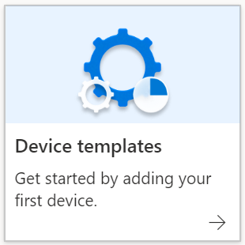
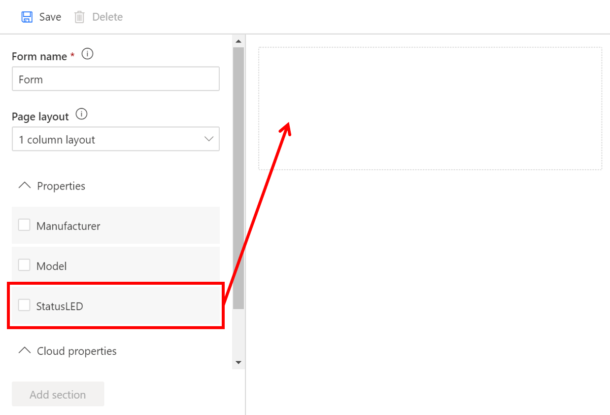
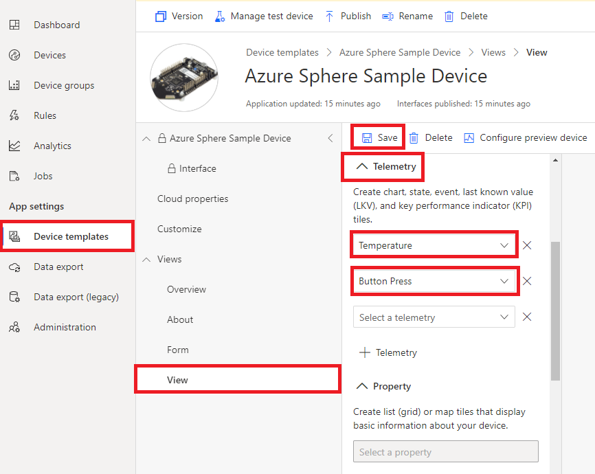
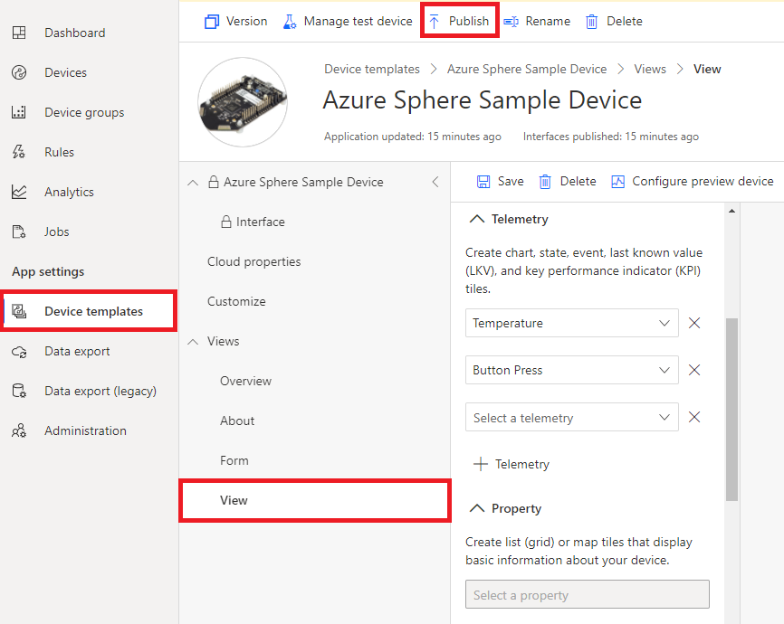
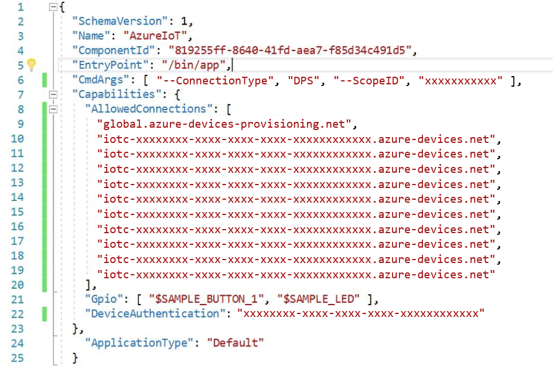

# Azure Sphere Device

This tutorial will guide you through the configuration of an Azure Sphere device (running a sample application), and how to provision it into the Eugenio platform.

## Step 1 - Install Requirements

* Install the Azure Sphere SDK for [Windows](https://docs.microsoft.com/en-us/azure-sphere/install/install-sdk) or for [Linux](https://docs.microsoft.com/en-us/azure-sphere/install/install-sdk-linux)
* [Choose a tenant and claim your device](https://docs.microsoft.com/en-us/azure-sphere/install/claim-device)
* [Configure networking and update the device OS](https://docs.microsoft.com/en-us/azure-sphere/install/configure-wifi)

## Step 2 - Set up Eugenio device connection settings to work with the Azure Sphere application

### Step 2.1 - Download the tenant authentication CA certificate

1. From the command prompt, sign in with your Azure Sphere login:

```bash
azsphere login
```

2. From the command prompt, sign in with your Azure Sphere login:

This command downloads the certificate to a file named CAcertificate.cer in the current working directory. Ensure that you run the command in a directory where you have write permissions, or the download operation will fail. Also note that the output file must have a .cer extension.

### Step 2.2 - Upload the tenant CA certificate to the Eugenio platform and generate a verification code

1. In the Eugenio web interface, go to **Administration > Device Connection > Create enrollment group.**

2. Create an enrollment group with **Attestation type: Certificates (X.509).**

3. Add and verify your primary X.509 certificate using the next steps.

### Step 2.3 - Verify the tenant CA certificate

1. Return to the command prompt.

2. Download a validation certificate that proves that you own the tenant CA certificate. Replace code in the command with the verification code from the previous step.

```bash
azsphere ca-certificate download-proof --destination ValidationCertification.cer --verification-code <code>
```

The Azure Sphere Security Service signs the validation certificate with the verification code to prove that you own the CA.

### Step 2.4 - Use the validation certificate to verify the tenant identity

1. Return to Eugenio and click **Verify.**

2. When prompted, navigate to the validation certificate that you downloaded in the previous step and select it. When the verification process is complete, the Primary Certificate dialog box displays the Verified message. Click **Close** to dismiss the box.

## Step 3 - Set up Eugenio device template to work with the Azure Sphere application

1. On the Dashboard for your application, select **Device Templates**.

   

1. On the **Select type** page, select **Azure Sphere Sample Device**. After making your selection, click **Next: Review** > **Create**.

1. On the device templates page for your Azure Sphere Sample Device, add two views to the sample device: one to send a command to the device, and another to show temperature and button press data.

   - To set up a view to send a command to the device, select **Views** > **Editing device and cloud data**.
   - Customize the **Form name** with "StatusLED".
   - Under **Property**, select **Status LED**, then **Add section**, and then click **Save** in the ribbon at the top of the form.

   

   - To set up a view of temperature and button press telemetry, select **Views** > **Visualizing the device**.
   - Customize the **View name** with "Temp and button press data".
   - Under **Telemetry**, use the dropdown menu to select **Temperature**, then **Add tile**.
   - Under **Telemetry**, use the dropdown menu to select **Button Press**, then **Add tile**.
   - Click **Save** in the ribbon at the top of the form.

   

1. Click **Publish** from the top menu bar so the device template can be used in the Azure IoT Central application.

   


## Step 4 - Configure the Azure Sphere sample application

To configure the sample application, update the following parameters in the app_manifest.json file:

* The allowed connections for your Azure Sphere device.
* The Scope ID for your Eugenio application.
* The Tenant ID for your Azure Sphere device.

Follow these steps to gather the information and configure the application:

1. Find the app_manifest.json file in your sample directory and open it.

1. At the command prompt, run the ShowIoTCentralConfig program from the Windows or Linux folder in the sample repository. For example, on Windows, the path is Samples\AzureIoT\Tools\win-x64\ShowIoTCentralConfig.exe. When running this tool on a Linux machine you may need to explicitly set permissions. For example, from a terminal, run `chmod +x ShowIoTCentralConfig` to set permissions on the tool.

   Now follow the prompts that the tool provides, and copy the information from the output into the app_manifest.json file. The tool will require the following input:

   * The **IoT Central App URL** can be found in your browser address bar; for example, `https://myiotcentralapp.azureiotcentral.com/`.

   * The **API token** can be generated from your IoT Central application. In the Eugenio application, select **Administration** > **API Tokens** > **Generate Token**, and then provide a name for the token; for example, "AzureSphereSample." Select **Administrator** as the role, and then click **Generate**. Copy the token to the clipboard. The token starts with **SharedAccessSignature**.

   * The **ID Scope** is in the Eugenio application. Select **Administration** > **Device Connection** and then copy the **ID Scope**.

1. At the command prompt, run the following command to get the Tenant ID:

   `azsphere tenant show-selected`

   Paste the GUID for your tenant into the **DeviceAuthentication** field of the app_manifest.json file.

   Your updated app-manifest.json file should look like the following example:

   

1. Save the updated application manifest.

1. Ensure that the **Auto approve** option is enabled. From the Eugenio Application, click **Administration** > **Device connection**, then on the **Auto approve** option, select **Enabled**.

## Build and run the sample

1. If you are using an IoT Central application that was created on or before July 7th, 2020, please make the following updates to the main.c file.
    - Open main.c and locate lines 751-762:
      ```c
      int statusLedValue = json_object_dotget_boolean(desiredProperties, "StatusLED");
      if (statusLedValue != -1) {
         statusLedOn = statusLedValue == 1;
         GPIO_SetValue(deviceTwinStatusLedGpioFd, statusLedOn ? GPIO_Value_Low : GPIO_Value_High);
      }

      // Report current status LED state
      if (statusLedOn) {
         TwinReportState("{\"StatusLED\":true}");
      } else {
         TwinReportState("{\"StatusLED\":false}");
      }
      ```
    - Replace lines 751-762 with the following code:
      ```c
      JSON_Object *LEDState = json_object_dotget_object(desiredProperties, "StatusLED");
      if (LEDState != NULL) {
         // ... with a "value" field which is a Boolean
         int statusLedValue = json_object_get_boolean(LEDState, "value");
         if (statusLedValue != -1) {
               statusLedOn = statusLedValue == 1;
               GPIO_SetValue(deviceTwinStatusLedGpioFd,
                           statusLedOn ? GPIO_Value_Low : GPIO_Value_High);
         }
      }

      // Report current status LED state
      if (statusLedOn) {
         TwinReportState("{\"StatusLED\":{\"value\":true}}");
      } else {
         TwinReportState("{\"StatusLED\":{\"value\":false}}");
      }
      ```
    - The application is now configured to run with the old IoT Central message format. For more information, please see the [IoT Central messaging documentation](https://docs.microsoft.com/azure/iot-central/core/concepts-telemetry-properties-commands).

1. Ensure that your device is connected to the internet.

1. Follow the steps in [Build a sample application](../../BUILD_INSTRUCTIONS.md).

1. See [Troubleshooting samples](../troubleshooting.md) if you encounter errors.

1. When the application starts, you should see output showing that the button and an LED have been opened, and that device authentication returned `AZURE_SPHERE_PROV_RESULT_OK`. The application then starts to send periodic messages with simulated temperatures to IoT Central.

1. Press button A. Device output shows the following message:

   ```
   Sending Azure IoT Hub telemetry: { "ButtonPress": "True" }
   INFO: IoTHubClient accepted the telemetry event for delivery
   ```

## Show your device data in Eugenio

1. In your Eugenio application, select **Devices** > **All Devices**. You should see your device listed as Unassociated and Unassigned. If you don’t see this, refresh the page.

1. Select your device and then select **Migrate**. Select the Azure Sphere Sample Device template, and click **Migrate**.

1. To view output from your Azure Sphere device, select **Devices** > **Azure Sphere Sample Device** and then select your device. You may change the device name at this point by selecting the name, modifying it, and selecting anywhere on the screen to save.

1. Select **View**, which is on the menu bar just under the device name. Note that the device is sending simulated temperatures at regular intervals. Each time you press button A, an event is added to the button press graph. The graphs show data averaged over 30 seconds and not every individual event will be visible on the graphs. To see the count of button presses, hover the cursor over the chart. Note that you will not see previous data on the Button Press chart initially and will instead see "Waiting for data".

1. Turn on an LED on your Azure Sphere device from the Eugenio application. Select the **Form** tab, click the **Status LED** checkbox, and then select **Save**. In a few seconds, the LED will light up.

1. Trigger an alarm from the Eugenio application. Select the **Command** tab and then click **Run**. Select the small history icon in the right corner of the Interface/Trigger Alarm box. This will show you the response to command from your sphere device. The device output will show the following message:

   ```
   ----- ALARM TRIGGERED! -----
   ```

## Troubleshooting

1. The following message in device output indicates a connection error:

   `IOTHUB_CLIENT_NO_CONNECTION`

   This error may occur if:

   - The **AllowedConnections** field has not been properly updated in the application manifest .json file.

   The application may generate output like "IoTHubClient accepted the message for delivery" while telemetry is generated. This indicates that the IoTHubClient has accepted the message for delivery but the data has not yet been sent to the IoT hub.

1. The following message in device output indicates an authentication error:

   `IoTHubDeviceClient_LL_CreateWithAzureSphereDeviceAuthProvisioning returned 'AZURE_SPHERE_PROV_RESULT_DEVICEAUTH_NOT_READY'.`

   This error may occur if:

   - The correct tenant ID is not present in the **DeviceAuthentication** field of the application manifest .json file.
   - The device has not been claimed.
   - When using the Azure IoT C SDK to connect to IoT Hub or IoT Central using device provisioning service, you must implement connection retry logic using your application. If you rely on internal retry logic, you may see an authentication error.

1. The following message in device output indicates a device provisioning error:

   `IoTHubDeviceClient_LL_CreateWithAzureSphereDeviceAuthProvisioning returned 'AZURE_SPHERE_PROV_RESULT_PROV_DEVICE_ERROR'.`

   This error may occur if:

   - The [setup for Eugenio](https://docs.microsoft.com/azure-sphere/app-development/setup-iot-central) has not been completed.


## Step 2 - Sample code
This sample demonstrates how to use the Azure IoT SDK C APIs in an Azure Sphere application to communicate with Eugenio. This sample can connect to Eugenio in two ways. It can connect directly to Eugenio with a device manually provisioned, or it can connect using the device provisioning service.

**IMPORTANT**: This sample application requires customization before it will compile and run. Follow the instructions in this README to perform the necessary steps.

This application does the following:

- Sends simulated temperature telemetry data to Eugenio at regular intervals.
- Sends a button-press event to Eugenio when you press button A on the MT3620 development board.
- Sends a simulated orientation state to Eugenio when you press button B on the MT3620 development board.
- Controls one of the LEDs on the MT3620 development board when you change a toggle setting on Eugenio or when you edit the device twin on Eugenio.

Before you can run the sample, you must configure either an Eugenio application, and modify the sample's application manifest to enable it to connect to the platform.

### Optional - Configure the board to connect to the internet using a ethernet adapter

By default, this sample runs over a Wi-Fi connection to the internet. To use Ethernet instead, make the following changes:

1. Configure Azure Sphere as described in [Connect Azure Sphere to Ethernet](https://docs.microsoft.com/azure-sphere/network/connect-ethernet).
1. Add an Ethernet adapter to your hardware. If you are using an MT3620 RDB, see the [wiring instructions](../../HardwareDefinitions/mt3620_rdb/EthernetWiring.md).
1. Add the following line to the Capabilities section of the app_manifest.json file:

   `"NetworkConfig" : true`

1. In main.c, ensure that the global constant networkInterface is set to "eth0". In source file AzureIoT/main.c, search for the following line:

   `static const char networkInterface[] = "wlan0";`

   and change it to:

   `static const char networkInterface[] = "eth0";`

1. In main.c, add the following lines before any other networking calls:

    ```c
     int err = Networking_SetInterfaceState("eth0", true);
     if (err == -1) {
           Log_Debug("Error setting interface state %d\n",errno);
           return -1;
       }
    ```

The sample uses the following Azure Sphere application libraries:

|Library   |Purpose  |
|---------|---------|
|log     |  Displays messages in the Device Output window during debugging  |
| networking | Determines whether the device is connected to the internet |
| gpio | Manages buttons A and B and LED 4 on the device |
| storage | Opens the certificate file that is used to authenticate to the IoT Edge device |
| [EventLoop](https://docs.microsoft.com/azure-sphere/reference/applibs-reference/applibs-eventloop/eventloop-overview) | Invoke handlers for timer events |

### Prerequisites

The sample requires the following software:

- Azure Sphere SDK version 21.01 or higher. At the command prompt, run [**azsphere show-version**](https://docs.microsoft.com/azure-sphere/reference/azsphere-show-version) to check. Install [the Azure Sphere SDK](https://docs.microsoft.com/azure-sphere/install/install-sdk), if necessary.
- An Azure subscription. If your organization does not already have one, you can set up a [free trial subscription](https://azure.microsoft.com/free/?v=17.15).

### Preparation

**Note:** By default, this sample targets [MT3620 reference development board (RDB)](https://docs.microsoft.com/azure-sphere/hardware/mt3620-reference-board-design) hardware, like the MT3620 development kit from Seeed Studios. To build the sample for different Azure Sphere hardware, change the Target Hardware Definition Directory in the CMakeLists.txt file. For detailed instructions, see the [README file in the HardwareDefinitions folder](../../HardwareDefinitions/README.md).

1. Set up your Azure Sphere device and development environment as described in [Azure Sphere documentation](https://docs.microsoft.com/azure-sphere/install/overview).
1. Clone the [Azure Sphere samples](https://github.com/Azure/azure-sphere-samples) repository and find the *AzureIoT* sample in the *AzureIoT* folder or download the zip file from the [Microsoft samples browser](https://docs.microsoft.com/samples/azure/azure-sphere-samples/azureiot/).
1. Connect your Azure Sphere device to your computer by USB.
1. Enable a network interface on your Azure Sphere device and verify that it is connected to the internet.
1. Open the [Azure Sphere command-line tool](https://docs.microsoft.com/azure-sphere/reference/overview) and [enable application development](https://docs.microsoft.com/azure-sphere/reference/azsphere-device#enable-development) on your device if you have not already done so:

   ```bash
   azsphere device enable-development
   ```

## References

This tutorial is a compilation of official Microsoft IoT related tutorials, adapted to the Eugenio platform, and the products / services used in it.

* https://docs.microsoft.com/en-us/azure/iot-central/core/howto-connect-sphere
* https://github.com/Azure/azure-sphere-samples/tree/master/Samples/AzureIoT
* https://docs.microsoft.com/en-us/azure-sphere/app-development/setup-iot-central?tabs=cliv2beta#step-2-download-the-tenant-authentication-ca-certificate